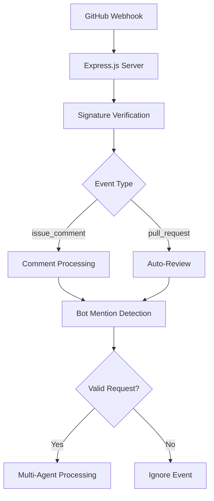
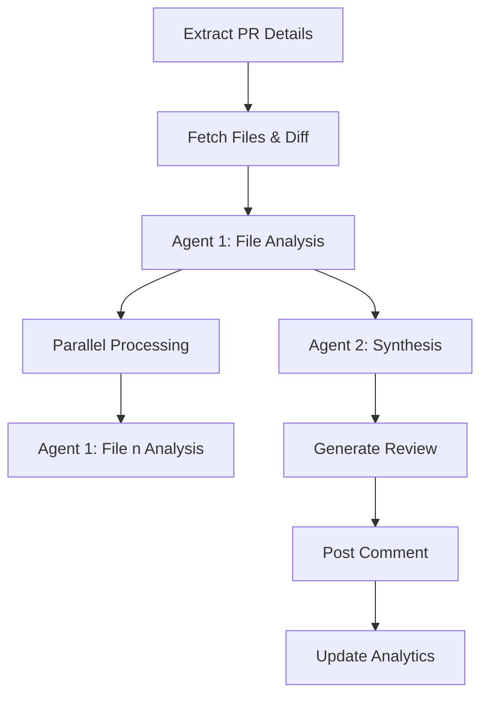
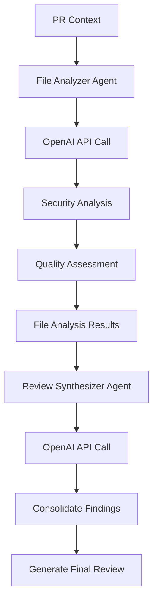
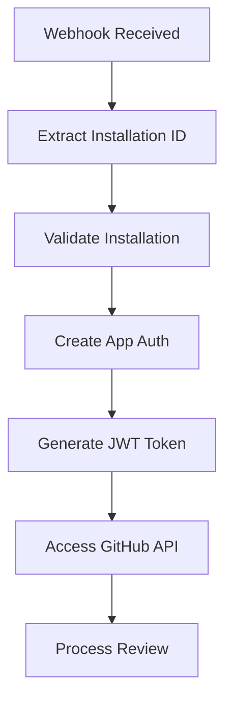
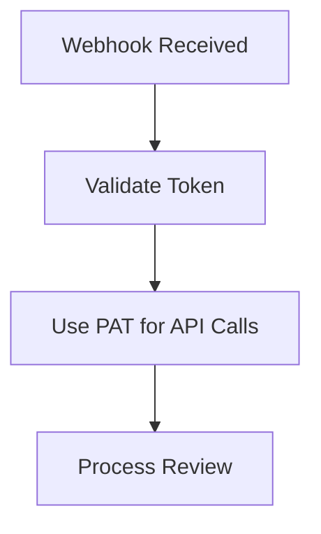

# 🏗️ Architecture

This document provides a comprehensive technical overview of the xibe-pr1 bot's architecture, including the multi-agent system, data flow, security design, and scalability considerations.

## 📐 System Architecture

xibe-pr1 follows a **microservices-inspired architecture** with clear separation of concerns, built on Node.js and designed for horizontal scalability.

```
┌─────────────────┐    ┌──────────────────┐    ┌─────────────────┐
│   GitHub        │───▶│   Webhook        │───▶│   OpenAI GPT    │
│   Webhooks      │    │   Handler        │    │   API           │
└─────────────────┘    └──────────────────┘    └─────────────────┘
                              │                        │
                              ▼                        ▼
┌─────────────────┐    ┌──────────────────┐    ┌─────────────────┐
│   Multi-Agent   │    │   Redis Cache    │    │   GitHub API    │
│   Review Engine │    │   & Analytics   │    │   Integration   │
└─────────────────┘    └──────────────────┘    └─────────────────┘
                              │                        │
                              ▼                        ▼
                       ┌─────────────────┐    ┌─────────────────┐
                       │   Review        │    │   Analytics     │
                       │   Comments      │    │   Dashboard     │
                       └─────────────────┘    └─────────────────┘
```

## 🤖 Multi-Agent System

The bot uses a sophisticated **two-agent architecture** that divides the complex task of code review into specialized stages:

### 🎯 **Agent 1: File Analyzer**
**Primary Responsibility**: Deep analysis of individual files

**Location**: `analyzeFileWithAI()` function in `bot.js`

**Key Features**:
- **Security-Focused**: Prioritizes detection of hardcoded credentials and vulnerabilities
- **File-Specific**: Analyzes each file individually for detailed insights
- **Context-Aware**: Considers PR title, description, and user comments
- **Pattern Recognition**: Identifies anti-patterns and code smells

**Input**:
```javascript
{
  filename: "src/auth.js",
  status: "modified",
  additions: 25,
  deletions: 10,
  patch: "diff content...",
  prTitle: "Add user authentication",
  prBody: "Implements JWT-based auth",
  userComment: "Check security implications"
}
```

**Output**:
```markdown
## 📄 **File: src/auth.js**

### 🔴 **CRITICAL ISSUES**
- 🔴 Hardcoded API key found in line 15: `API_KEY = "sk-123456"`
- 🔴 SQL injection vulnerability in line 25

### ⚠️ **Security Concerns**
- Missing input validation for user credentials
- Password stored in plain text

### 💡 **Code Quality Issues**
- Consider using environment variables for configuration
- Add proper error handling for database operations
```

### 🎯 **Agent 2: Review Synthesizer**
**Primary Responsibility**: Comprehensive review creation and synthesis

**Location**: `synthesizeReviewFromAnalyses()` function in `bot.js`

**Key Features**:
- **Holistic Analysis**: Consolidates findings from all file analyses
- **Priority Management**: Ranks issues by severity and importance
- **User Tagging**: Tags relevant users (@author, @reviewer)
- **Decision Making**: Provides clear APPROVE/REQUEST_CHANGES/COMMENT verdicts

**Input**: Array of individual file analyses + PR context

**Output**:
```markdown
## 🤖 AI Code Review

**@johnsmith** - Thank you for your contribution!

### ✅ **Recommendation**
REQUEST_CHANGES - Critical security issues found that must be addressed

### 📋 **Summary**
**What this PR does:** Implements user authentication system
**Impact:** Adds security layer to the application
**Files analyzed:** 3 files

### 🔴 **CRITICAL ISSUES**
- 🔴 Hardcoded API key found in src/auth.js (line 15)
- 🔴 SQL injection vulnerability in database queries

### ⚠️ **Security & Best Practices**
- Move credentials to environment variables
- Implement parameterized queries for database access
```

## 🔄 Data Flow

### 1️⃣ **Webhook Reception**


### 2️⃣ **Processing Pipeline**


### 3️⃣ **AI Integration**


## 🔧 Core Components

### 🌐 **Webhook Handler** (`/webhook`)
**Location**: Lines 1194-1504 in `bot.js`

**Responsibilities**:
- **Event Processing**: Handles `issue_comment` and `pull_request` events
- **Authentication**: Validates GitHub webhook signatures and installation IDs
- **Routing**: Directs requests to appropriate handlers
- **Logging**: Comprehensive webhook logging with Redis persistence

**Key Features**:
- **Signature Verification**: Ensures webhook authenticity
- **Installation Validation**: Verifies GitHub App installations
- **Error Recovery**: Graceful handling of authentication failures
- **Rate Limiting**: Smart filtering to prevent duplicate processing

### 🔍 **Review Engine**
**Location**: Lines 604-658 in `bot.js`

**Core Functions**:
- `reviewCodeWithAI()` - Main multi-agent processing function
- `analyzeFileWithAI()` - Individual file analysis (Agent 1)
- `synthesizeReviewFromAnalyses()` - Review synthesis (Agent 2)
- `handlePRReviewRequest()` - Main request handler with locking

### 🔒 **Security Layer**

#### Authentication Modes
1. **GitHub App Mode**: Preferred for production deployments
2. **Personal Access Token**: Suitable for individual developers
3. **Test Mode**: For development and testing without GitHub API

#### Security Measures
- **Webhook Signature Verification**: Validates incoming webhook authenticity
- **Installation ID Validation**: Ensures proper GitHub App setup
- **Rate Limiting**: Prevents spam and duplicate processing
- **Input Sanitization**: Validates and limits comment content
- **Redis-based Locking**: Atomic processing to prevent race conditions

### 📊 **Analytics & Monitoring**

#### Redis Storage Structure
```
analytics:global
├── totalUsers: 150
├── totalReviews: 1250
└── lastUpdated: "2024-01-15T10:30:00Z"

user:username:stats
├── reviews: 25
├── lastActive: "2024-01-15T09:15:00Z"
└── totalReviews: 25

webhook:uuid123
├── id: "uuid123"
├── timestamp: "2024-01-15T10:30:00Z"
├── status: "completed"
├── repository: "owner/repo"
└── processingTime: 15000

review:review456
├── id: "review456"
├── timestamp: "2024-01-15T10:30:00Z"
├── repository: "owner/repo"
├── user: "username"
└── reviewContent: "..."
```

## 🚀 Scalability Design

### **Horizontal Scaling**
- **Stateless Architecture**: No server-side session storage
- **Redis Clustering**: Supports Redis Cluster for high availability
- **Load Balancing**: Compatible with standard load balancers
- **Container Ready**: Docker and Kubernetes compatible

### **Performance Optimizations**
- **Concurrent Processing**: Handles multiple PRs simultaneously
- **AI API Optimization**: Efficient prompt engineering and token usage
- **Caching Strategy**: Redis-based caching for frequently accessed data
- **Connection Pooling**: Efficient GitHub and OpenAI API connection management

### **Resource Management**
- **Memory Efficient**: Optimized for low memory footprint
- **Connection Reuse**: Persistent connections to external APIs
- **Timeout Handling**: Proper timeout configuration for all external calls
- **Graceful Degradation**: Continues operation even with partial service failures

## 🔌 API Design

### **RESTful Endpoints**

#### Public Endpoints
- `GET /` - Landing page with bot status
- `GET /health` - Health check endpoint
- `GET /status` - Dashboard access
- `POST /webhook` - GitHub webhook handler

#### API Endpoints
- `GET /api/status` - Bot status and configuration
- `GET /api/webhooks` - Webhook logs and statistics
- `GET /api/analytics` - Global analytics data
- `GET /api/models` - Available AI models
- `GET /api/troubleshoot` - System diagnostics

### **Response Formats**

#### Health Check Response
```json
{
  "status": "ok",
  "timestamp": "2024-01-15T10:30:00Z"
}
```

#### Analytics Response
```json
{
  "success": true,
  "data": {
    "totalUsers": 150,
    "totalReviews": 1250,
    "recentReviews": 25
  },
  "timestamp": "2024-01-15T10:30:00Z"
}
```

## 🗄️ Data Storage

### **Redis Schema**

#### Analytics Tables
- `analytics:global` - Global statistics and metrics
- `user:{username}:stats` - Per-user review statistics
- `user:{username}:info` - User profile information

#### Webhook Logging
- `webhook:{id}` - Individual webhook event logs
- `webhook:recent` - List of recent webhook IDs
- `webhook:stats` - Webhook processing statistics

#### Review Storage
- `review:{id}` - Individual review records
- `reviews:all` - List of all review IDs for chronological ordering

#### Processing Locks
- `lock:review:{owner}:{repo}:{pr}` - Prevents duplicate processing
- `recent_comment:{owner}:{repo}:{pr}` - Rate limiting for comments
- `processed_comment:{owner}:{repo}:{commentId}` - Duplicate comment prevention

### **Data Retention**
- **Webhook Logs**: 7 days with automatic expiration
- **Review Records**: 30 days for analytics purposes
- **User Statistics**: Persistent for historical tracking
- **Processing Locks**: 10 minutes to prevent permanent locks

## 🔐 Security Architecture

### **Authentication Flow**

#### GitHub App Authentication


#### Personal Access Token Authentication


### **Security Measures**

#### Input Validation
- **Comment Filtering**: Regex-based mention detection
- **Content Limiting**: Maximum comment length and mention limits
- **Pattern Matching**: Sophisticated bot mention pattern recognition

#### API Security
- **HTTPS Only**: All external communications use HTTPS
- **Token Management**: Secure handling of API keys and tokens
- **Request Validation**: Comprehensive input validation and sanitization

## 📈 Monitoring & Observability

### **Built-in Monitoring**
- **Health Checks**: Automated health status endpoints
- **Performance Metrics**: Response times and resource usage
- **Error Tracking**: Comprehensive error logging and reporting
- **Analytics**: Usage statistics and trend analysis

### **External Monitoring Integration**
- **Webhook Delivery**: GitHub App webhook delivery monitoring
- **API Monitoring**: OpenAI API usage and performance tracking
- **Infrastructure Monitoring**: Server health and performance metrics

## 🚀 Deployment Architecture

### **Container Deployment**
```dockerfile
FROM node:18-alpine
WORKDIR /app
COPY package*.json ./
RUN npm install --production
COPY . .
EXPOSE 3000
USER node
CMD ["node", "bot.js"]
```

### **Cloud Deployment Options**
- **Railway**: One-click deployment with automatic scaling
- **Render**: Production-grade deployment with managed databases
- **Vercel**: Serverless deployment option
- **Docker**: Containerized deployment for any cloud provider

## 🔧 Development Architecture

### **Development Environment**
- **Hot Reload**: Automatic restart on code changes
- **Debug Logging**: Comprehensive logging for development
- **Test Mode**: Full functionality without GitHub API dependencies
- **Mock Data**: Simulated GitHub API responses for testing

### **Testing Architecture**
- **Unit Tests**: Individual function testing
- **Integration Tests**: Full webhook processing pipeline
- **End-to-End Tests**: Complete review generation workflows
- **Performance Tests**: Load testing and scalability validation

## 📊 Performance Characteristics

### **Response Times**
- **Small PRs (1-3 files)**: 10-20 seconds
- **Medium PRs (4-10 files)**: 30-60 seconds
- **Large PRs (10+ files)**: 1-3 minutes

### **Resource Usage**
- **Memory**: ~50-100MB base, ~10MB per concurrent review
- **CPU**: Minimal CPU usage, primarily I/O bound
- **Network**: Efficient API usage with connection reuse
- **Storage**: Minimal local storage, Redis for persistence

### **Scalability Limits**
- **Concurrent Reviews**: 100+ simultaneous reviews
- **Throughput**: 1000+ reviews per hour
- **API Rate Limits**: Respects GitHub and OpenAI rate limits
- **Redis Load**: Optimized for high-frequency operations

## 🔄 Error Handling & Recovery

### **Error Recovery Mechanisms**
- **Graceful Degradation**: Continues operation with partial failures
- **Retry Logic**: Automatic retry for transient failures
- **Fallback Modes**: Test mode for development and API failures
- **Lock Cleanup**: Automatic cleanup of stale processing locks

### **Error Monitoring**
- **Webhook Logging**: Complete audit trail of all events
- **Error Classification**: Categorization of error types and severity
- **Alert Integration**: Ready for integration with monitoring systems

---

This architecture enables xibe-pr1 to provide reliable, scalable, and secure AI-powered code review capabilities while maintaining excellent performance and developer experience.
