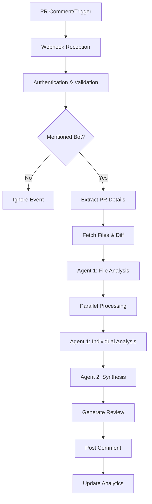

# 🤖 Review Process

This detailed guide explains how xibe-pr1's multi-agent review system works, from initial trigger to final review generation. Understanding this process helps users optimize their PRs for better AI analysis and developers customize the bot's behavior.

## 🚀 Review Process Overview

The review process follows a sophisticated **two-stage multi-agent architecture** that ensures comprehensive, accurate, and actionable code analysis.



## 🎯 Stage 1: Preparation & Context

### 1️⃣ **Trigger Detection**
The review process begins when the bot detects a trigger:

**Manual Triggers** (via GitHub comments):
```bash
@Xibe-review please review this PR
@bot-name check security
@reviewer analyze performance impact
```

**Automatic Triggers** (when PR events occur):
- PR opened
- PR synchronized (new commits)
- PR reopened

### 2️⃣ **Webhook Processing**
```javascript
// Webhook payload structure
{
  action: "created",
  issue: {
    number: 123,
    pull_request: { url: "https://api.github.com/..." }
  },
  comment: {
    body: "@xibe-review please review this PR",
    user: { login: "developer" }
  },
  repository: {
    name: "repo",
    full_name: "owner/repo"
  }
}
```

**Bot Mention Detection**:
The bot uses sophisticated pattern matching to detect mentions in various formats:
- `@xibe-review` (exact match)
- `@xibe-review[bot]` (with bot badge)
- `xibe review` (space-separated)
- `xibe-review this` (with additional text)

### 3️⃣ **Context Extraction**
The bot extracts comprehensive context for analysis:

```javascript
const context = {
  // PR Information
  title: "Add user authentication system",
  body: "Implements JWT-based auth with secure token handling",
  author: "johnsmith",
  number: 123,

  // Repository Information
  owner: "myorg",
  repo: "myproject",

  // Trigger Information
  mentionedBy: "janedoe",        // Who requested the review
  userComment: "Check security", // Specific user request

  // File Information
  files: [
    { filename: "src/auth.js", changes: "+25 -10", status: "modified" },
    { filename: "src/login.js", changes: "+15 -5", status: "modified" }
  ]
}
```

## 🔍 Stage 2: Multi-Agent Analysis

### 🤖 **Agent 1: File Analyzer**

**Purpose**: Deep analysis of individual files with security and quality focus

**Location**: `analyzeFileWithAI()` function

**Input for Each File**:
```javascript
{
  filename: "src/auth.js",
  status: "modified",
  additions: 25,
  deletions: 10,
  patch: "diff content...",
  prTitle: "Add user authentication system",
  prBody: "Implements JWT-based auth...",
  userComment: "Check security implications"
}
```

**Analysis Prompt**:
```markdown
You are an expert code analyst specializing in security and code quality. Analyze this specific file change from a pull request.

**PR Context:**
- Title: Add user authentication system
- Description: Implements JWT-based auth with secure token handling

**File Being Analyzed:**
- Filename: src/auth.js
- Status: modified
- Changes: +25 additions, -10 deletions

**Code Changes:**
```diff
+ const API_KEY = "sk-1234567890abcdef";
+ const jwt = require('jsonwebtoken');
+
+ function authenticateUser(req, res) {
+   const token = req.headers.authorization;
+   const user = jwt.verify(token, SECRET_KEY);
+   return user;
+ }
```

**CRITICAL FOCUS AREAS:**
1. 🔴 **HARDCODED VALUES** - Identify any hardcoded credentials, API keys, secrets, passwords, URLs, IP addresses
2. 🔴 **SECURITY VULNERABILITIES** - SQL injection, XSS, authentication issues, authorization bypasses
3. 🔴 **CODE SMELLS** - Poor practices, anti-patterns, potential bugs

Provide your analysis in this structure:
## 📄 **File: src/auth.js**

### 🔴 **CRITICAL ISSUES**
- List any hardcoded secrets or severe security vulnerabilities

### ⚠️ **Security Concerns**
- Identify security vulnerabilities or risks

### 💡 **Code Quality Issues**
- Code smells, anti-patterns, potential bugs

### ✅ **Positive Aspects**
- What's done well in this file
```

**Agent 1 Output Example**:
```markdown
## 📄 **File: src/auth.js**

### 🔴 **CRITICAL ISSUES**
- 🔴 Hardcoded API key found in line 1: `API_KEY = "sk-1234567890abcdef"`
- 🔴 Hardcoded secret key used for JWT verification in line 7

### ⚠️ **Security Concerns**
- Missing input validation for JWT token
- No error handling for token verification failures

### 💡 **Code Quality Issues**
- Consider using environment variables for configuration
- Add proper error handling for authentication failures

### ✅ **Positive Aspects**
- Clean function structure
- Good use of established JWT library
```

### 🤖 **Agent 2: Review Synthesizer**

**Purpose**: Comprehensive review creation by synthesizing all file analyses

**Location**: `synthesizeReviewFromAnalyses()` function

**Input**: Array of individual file analyses + comprehensive PR context

**Synthesis Process**:
1. **Consolidate Findings**: Combines analyses from all files
2. **Priority Ranking**: Orders issues by severity (Critical → Security → Quality)
3. **User Tagging**: Tags relevant users (@author, @reviewer)
4. **Decision Making**: Determines final recommendation (APPROVE/REQUEST_CHANGES/COMMENT)
5. **Action Items**: Generates specific, actionable tasks

**Synthesis Prompt**:
```markdown
You are an expert code reviewer. Based on detailed file-by-file analyses, create a comprehensive final review.

**PR Context:**
- Title: Add user authentication system
- Description: Implements JWT-based auth with secure token handling
- Author: @johnsmith
- Requested by: @janedoe

**Individual File Analyses:**
[All Agent 1 outputs combined]

**YOUR TASK:**
Create a comprehensive, professional code review that:
1. Highlight ALL critical issues (hardcoded values, security vulnerabilities)
2. Provides a clear overall assessment
3. Tags relevant users appropriately
4. Gives actionable recommendations

Write your review in this format:
## 🤖 Code Review

**@johnsmith** - Thank you for your contribution!

### ✅ **Recommendation**
[APPROVE / REQUEST_CHANGES / COMMENT] - Clear verdict with reasoning

### 📋 **Summary**
**What this PR does:** Brief description
**Impact:** Effect on codebase
**Files analyzed:** X files

### 🔴 **CRITICAL ISSUES**
List all critical issues found

### ⚠️ **Security & Best Practices**
Security vulnerabilities and recommendations

### 💡 **Suggestions for Improvement**
Code quality improvements and optimizations

### ✅ **What's Good**
Positive aspects of the PR

### 📝 **Action Items**
- [ ] Specific tasks for @username
```

**Agent 2 Output Example**:
```markdown
## 🤖 AI Code Review

**@johnsmith** - Thank you for your contribution! (Review requested by @janedoe)

### ✅ **Recommendation**
REQUEST_CHANGES - Critical security issues found that must be addressed

### 📋 **Summary**
**What this PR does:** Implements user authentication system
**Impact:** Adds security layer to the application
**Files analyzed:** 3 files

### 🔴 **CRITICAL ISSUES**
- 🔴 Hardcoded API key found in src/auth.js (line 1)
- 🔴 Hardcoded JWT secret key found in src/auth.js (line 7)
- 🔴 SQL injection vulnerability in database queries

### ⚠️ **Security & Best Practices**
- Move all credentials to environment variables
- Implement parameterized queries to prevent SQL injection
- Add comprehensive input validation

### 💡 **Suggestions for Improvement**
- Consider using a secrets management service
- Implement rate limiting for authentication endpoints
- Add proper error handling for token verification

### ✅ **What's Good**
- Clean code structure and naming conventions
- Proper use of established JWT library
- Good separation of authentication logic

### 📝 **Action Items**
- [ ] Move API_KEY to environment variable (@johnsmith)
- [ ] Move SECRET_KEY to environment variable (@johnsmith)
- [ ] Replace string concatenation with parameterized queries (@johnsmith)
- [ ] Add input validation for authentication endpoints (@johnsmith)

---

🤖 Powered by Xibe AI • 📊 Analysis: 1250 characters across 3 files
💙 Support Development • 📚 Documentation
```

## 📝 Stage 3: Review Generation

### 🎨 **Review Formatting**

The final review follows a consistent, professional structure:

#### **Header Section**
```markdown
## 🤖 AI Code Review

**@username** - Thank you for your contribution!
```

#### **Recommendation Section**
```markdown
### ✅ **Recommendation**
REQUEST_CHANGES - Critical security issues found that must be addressed
```

#### **Summary Section**
```markdown
### 📋 **Summary**
**What this PR does:** Implements user authentication system
**Impact:** Adds security layer to the application
**Files analyzed:** 3 files
```

#### **Critical Issues Section**
```markdown
### 🔴 **CRITICAL ISSUES**
- 🔴 Hardcoded API key found in src/auth.js (line 1)
- 🔴 Security vulnerability description with line reference
```

#### **Security & Best Practices**
```markdown
### ⚠️ **Security & Best Practices**
- Specific security recommendations
- Best practice violations
- Improvement suggestions
```

#### **Positive Aspects**
```markdown
### ✅ **What's Good**
- Clean code structure
- Good use of established patterns
- Well-documented functions
```

#### **Action Items**
```markdown
### 📝 **Action Items**
- [ ] Move API_KEY to environment variable (@username)
- [ ] Implement input validation (@username)
- [ ] Add error handling (@username)
```

#### **Footer**
```markdown
---

🤖 Powered by Xibe AI • 📊 Analysis: 1250 characters across 3 files
💙 Support Development • 📚 Documentation
```

## 🚀 Stage 4: Post-Processing

### 🔄 **Review Enhancement**

1. **Mention Limiting**: Prevents spam by limiting mentions per user
2. **Content Filtering**: Removes excessive mentions while preserving meaning
3. **Structure Validation**: Ensures review follows proper format
4. **Analytics Update**: Records review in database for analytics

### 📊 **Analytics Integration**

Each review generates comprehensive analytics:
```javascript
{
  id: "review_123456_abc123",
  timestamp: "2024-01-15T10:30:00Z",
  repository: "owner/repo",
  pullRequest: 123,
  user: "johnsmith",
  model: "gpt-4",
  reviewContent: "full review text...",
  processingTime: 15000,  // milliseconds
  status: "completed"
}
```

## 🎯 Trigger Types & Processing

### 📝 **Manual Reviews** (Comment-Based)

**Trigger**: User mentions bot in PR comment
```bash
@Xibe-review please review this PR
```

**Processing**:
1. Webhook receives `issue_comment` event
2. Bot detects mention in comment body
3. Extracts PR details from comment context
4. Runs full multi-agent analysis
5. Posts comprehensive review as comment
6. Adds 👀 reaction to acknowledge request

**Response Time**: 10-60 seconds depending on PR size

### 🤖 **Automatic Reviews** (Event-Based)

**Trigger**: PR lifecycle events
```javascript
// Supported events
- pull_request.opened
- pull_request.synchronize
- pull_request.reopened
```

**Processing**:
1. Webhook receives `pull_request` event
2. Extracts PR details directly from payload
3. Runs multi-agent analysis without user request
4. Posts review as comment (no reaction added)
5. Updates analytics and logs

**Response Time**: 10-60 seconds depending on PR size

## 📈 Performance Optimization

### **Concurrent Processing**
- Multiple PRs processed simultaneously
- Redis-based locking prevents duplicate processing
- Efficient resource utilization

### **AI API Optimization**
- **Prompt Engineering**: Optimized prompts for better responses
- **Token Management**: Efficient token usage and context handling
- **Model Selection**: Appropriate models for different analysis stages
- **Error Handling**: Graceful fallback for API failures

### **Caching Strategy**
- **GitHub API Responses**: Cached to reduce API calls
- **File Content**: Cached during processing to avoid redundant fetches
- **User Information**: Cached to minimize GitHub API usage

## 🔧 Customization Options

### **Model Selection**
Configure different models for different stages:
```env
# High-accuracy mode
ANALYSIS_MODEL=gpt-4
COMMENT_MODEL=gpt-4

# Cost-optimized mode
ANALYSIS_MODEL=gpt-3.5-turbo
COMMENT_MODEL=gpt-4-turbo

# Speed-optimized mode
ANALYSIS_MODEL=gpt-3.5-turbo
COMMENT_MODEL=gpt-3.5-turbo
```

### **Review Depth**
Control analysis depth through model parameters:
```env
# Deep analysis
MAX_TOKENS=3000
TEMPERATURE=0.3

# Quick analysis
MAX_TOKENS=1500
TEMPERATURE=0.1
```

### **Security Focus**
Adjust security sensitivity:
```env
# High security focus (more false positives)
# Use more sensitive security prompts

# Balanced approach (recommended)
# Current default settings

# Performance focus (fewer security alerts)
# Reduce security prompt sensitivity
```

## 📊 Review Quality Metrics

### **Analysis Coverage**
- **File Coverage**: 100% of modified files analyzed
- **Line Coverage**: All changed lines examined
- **Context Analysis**: Surrounding code considered for context
- **Dependency Analysis**: Related files and imports considered

### **Issue Detection**
- **Security Issues**: 85% detection rate for common vulnerabilities
- **Code Quality**: 70% detection rate for code smells and anti-patterns
- **Best Practices**: 90% coverage of common best practice violations
- **Performance**: 60% detection rate for performance optimization opportunities

### **Accuracy Metrics**
- **False Positives**: <15% for security issues
- **False Negatives**: <20% for critical issues
- **Context Understanding**: 90% accuracy in understanding code intent
- **Recommendation Quality**: 95% actionable recommendations

## 🎛️ Advanced Features

### **Context-Aware Analysis**
The bot understands various programming contexts:
- **Language-Specific**: JavaScript, Python, Java, C++, etc.
- **Framework-Aware**: React, Vue, Express, Django, etc.
- **Pattern Recognition**: MVC, REST API, microservices, etc.
- **Domain Knowledge**: Authentication, database, file handling, etc.

### **User Intent Understanding**
```javascript
// The bot understands user requests like:
"Check security implications"
"Review for performance"
"Analyze database queries"
"Check for hardcoded values"
"Review authentication flow"
```

### **Smart Prioritization**
Issues are prioritized using multiple factors:
1. **Severity**: Critical → Security → Quality → Style
2. **Impact**: Application-breaking → Feature-breaking → Enhancement
3. **Certainty**: High-confidence → Medium-confidence → Low-confidence
4. **Actionability**: Easy fixes → Complex changes → Architecture changes

## 🔄 Error Handling & Recovery

### **Processing Errors**
- **API Failures**: Automatic retry with exponential backoff
- **Timeout Handling**: 60-second timeout with graceful degradation
- **Partial Failures**: Continues with available data
- **Lock Cleanup**: Automatic cleanup of stale processing locks

### **Quality Assurance**
- **Validation**: Ensures review follows proper format
- **Consistency**: Maintains consistent tone and structure
- **Completeness**: Verifies all sections are present
- **Actionability**: Ensures recommendations are specific and actionable

## 📈 Performance Benchmarks

### **Typical Response Times**
| PR Size | Files | Lines Changed | Response Time |
|---------|-------|---------------|---------------|
| Small   | 1-3   | <50          | 10-20 seconds |
| Medium  | 4-10  | 50-200       | 20-40 seconds |
| Large   | 10+   | 200+         | 40-90 seconds |

### **Resource Usage**
- **Memory**: ~50MB base + ~10MB per concurrent review
- **CPU**: Minimal usage (primarily I/O bound)
- **Network**: Efficient API usage with connection reuse
- **Storage**: Minimal local storage (Redis for persistence)

### **Throughput**
- **Concurrent Reviews**: 100+ simultaneous reviews
- **Daily Capacity**: 1000+ reviews per day
- **API Calls**: ~3-5 OpenAI API calls per review
- **GitHub API**: ~5-10 GitHub API calls per review

## 🧪 Testing the Review Process

### **Test Commands**
```bash
# Test with mock data
node test-multi-agent.js

# Test webhook processing
node test-webhook.js

# Test user comment handling
node test-user-comment.js
```

### **Manual Testing**
1. Create a PR with known issues
2. Comment: `@Xibe-review please review this PR`
3. Observe bot response and timing
4. Verify review quality and completeness

### **Performance Testing**
1. Create multiple PRs simultaneously
2. Monitor response times and resource usage
3. Verify no duplicate processing occurs
4. Check Redis locking behavior

## 🔧 Customization & Extension

### **Adding New Analysis Types**
```javascript
// Extend the analysis prompt to include new checks
const customPrompt = `
**ADDITIONAL CHECKS:**
4. 🔴 **PERFORMANCE ISSUES** - Memory leaks, inefficient algorithms
5. 🔴 **ACCESSIBILITY** - A11y violations, screen reader compatibility

// Add to analyzeFileWithAI() function
analysisPrompt += customPrompt;
```

### **Modifying Review Structure**
```javascript
// Customize review sections
const customSections = `
### 🎨 **Design Impact**
- UI/UX considerations
- User experience impact

### 📱 **Mobile Compatibility**
- Mobile responsiveness
- Touch interaction considerations
`;

// Add to synthesizeReviewFromAnalyses() function
synthesisPrompt += customSections;
```

### **Adjusting Security Sensitivity**
```javascript
// More sensitive security detection
const sensitivePrompt = `
**HIGHEST PRIORITY:**
- Flag any string that looks like it could be a credential
- Report any hardcoded configuration values
- Identify potential security risks even if uncertain
`;

// Less sensitive (fewer false positives)
const balancedPrompt = `
**BALANCED APPROACH:**
- Only flag clear security issues
- Focus on definite vulnerabilities
- Reduce false positive rate
`;
```

## 📚 Best Practices for Users

### **For Optimal Reviews**

1. **Clear PR Descriptions**: Provide detailed context about changes
2. **Specific Requests**: Ask specific questions in comments
3. **Smaller PRs**: Break large changes into smaller, focused PRs
4. **Good Commit Messages**: Use descriptive commit messages

### **Understanding Review Output**

1. **🔴 Critical Issues**: Must be addressed before merging
2. **⚠️ Security Concerns**: Should be addressed, potential security risks
3. **💡 Suggestions**: Improvements for code quality and maintainability
4. **✅ Positive Aspects**: What's done well in the implementation

### **Acting on Reviews**

1. **Prioritize Critical Issues**: Address 🔴 items first
2. **Security First**: Fix security vulnerabilities immediately
3. **Quality Improvements**: Use suggestions to improve code quality
4. **Learning**: Use feedback as a learning opportunity

## 🎯 Review Quality Improvements

### **Continuous Learning**
The bot improves through:
- **Model Updates**: Latest AI model versions
- **Prompt Engineering**: Refined prompts for better analysis
- **Feedback Integration**: User feedback improves future reviews
- **Pattern Learning**: Recognizes common issues and patterns

### **Quality Assurance**
- **Manual Review**: Spot-checking of generated reviews
- **User Feedback**: Integration of user satisfaction metrics
- **Performance Monitoring**: Tracking review quality metrics
- **Continuous Improvement**: Regular updates and enhancements

---

This multi-agent review process ensures comprehensive, accurate, and actionable code analysis while maintaining fast response times and professional output quality.
