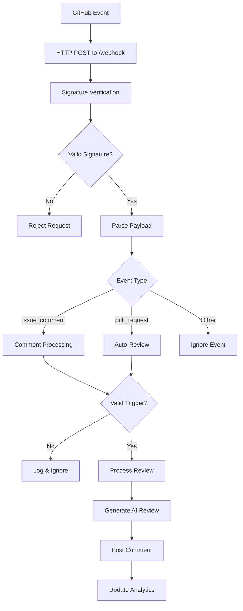

# 📡 Webhook Handling

This comprehensive guide explains how xibe-pr1 handles GitHub webhooks, including event processing, security validation, error handling, and troubleshooting.

## 🌐 Webhook Overview

Webhooks are HTTP callbacks that GitHub uses to notify your bot about events in repositories. xibe-pr1 uses webhooks to automatically detect when users request reviews or when PRs are created/updated.

### **Webhook Flow**


## 📡 Webhook Configuration

### **Repository Webhook Setup**

1. **Navigate to Repository Settings**
   - Go to your repository on GitHub
   - Click **Settings** tab
   - Click **Webhooks** in the left sidebar

2. **Add Webhook**
   ```txt
   Payload URL: https://your-domain.com/webhook
   Content type: application/json
   Secret: [leave empty or use webhook secret]
   Which events would you like to trigger this webhook?
   ```

3. **Select Events**
   - ✅ **Issue comments** (required for manual reviews)
   - ✅ **Pull requests** (required for auto-reviews)
   - ✅ **Let me select individual events** (recommended)

4. **Security Settings**
   - **SSL verification**: Ensure **"Enable SSL verification"** is checked
   - **Secret**: Use the same secret as in your `.env` file
   - **Active**: Ensure webhook is active

### **GitHub App Webhook Setup**

1. **Configure in GitHub App Settings**
   ```txt
   Webhook URL: https://your-domain.com/webhook
   Webhook secret: your_32_character_secret
   ```

2. **Subscribe to Events**
   - ✅ **Issue comment** (for manual review requests)
   - ✅ **Pull request** (for automatic reviews)
   - ✅ **Pull request review** (optional)

3. **Install App**
   - Install the app on your repositories
   - Grant necessary permissions
   - Configure repository access

## 🔒 Webhook Security

### **Signature Verification**

GitHub signs all webhook payloads with a secret token:

```javascript
// GitHub signature format
X-Hub-Signature-256: sha256=abc123...

// Verification process
const payload = JSON.stringify(req.body);
const signature = req.headers['x-hub-signature-256'];
const expectedSignature = `sha256=${crypto.createHmac('sha256', secret).update(payload).digest('hex')}`;

if (signature !== expectedSignature) {
  throw new Error('Invalid signature');
}
```

**Security Benefits**:
- ✅ **Authenticity**: Verifies request comes from GitHub
- ✅ **Integrity**: Ensures payload hasn't been tampered with
- ✅ **Non-repudiation**: Prevents spoofed webhook requests

### **Installation ID Validation**

For GitHub App mode, the bot validates installation IDs:

```javascript
// Extract installation ID from webhook
const installationId = payload.installation?.id;

// Validate and use for authentication
if (installationId) {
  const octokit = await getOctokitForInstallation(installationId);
  // Process request with proper authentication
}
```

### **Rate Limiting & Spam Prevention**

The bot implements multiple layers of protection:

```javascript
// 1. Duplicate Comment Prevention
const processedKey = `processed_comment:${owner}:${repo}:${commentId}`;
const alreadyProcessed = await redis.get(processedKey);

// 2. Recent Activity Limiting
const recentKey = `recent_comment:${owner}:${repo}:${pr}`;
const recentComment = await redis.get(recentKey);

// 3. Mention Limiting
const limitedComment = limitMentionsInComment(comment, 2);
```

## 📨 Supported Events

### **Issue Comment Events** (`issue_comment`)

Triggered when users comment on issues or pull requests.

**Payload Structure**:
```json
{
  "action": "created",
  "issue": {
    "id": 123456789,
    "number": 123,
    "title": "Bug report",
    "body": "This is a bug",
    "pull_request": {
      "url": "https://api.github.com/repos/owner/repo/pulls/123"
    }
  },
  "comment": {
    "id": 987654321,
    "body": "@xibe-review please review this PR",
    "user": {
      "login": "developer"
    }
  },
  "repository": {
    "id": 123456789,
    "name": "repo",
    "full_name": "owner/repo",
    "owner": {
      "login": "owner"
    }
  },
  "installation": {
    "id": 12345678
  },
  "sender": {
    "login": "developer"
  }
}
```

**Processing Logic**:
1. Check if comment is on a pull request (`issue.pull_request` exists)
2. Detect bot mention in comment body
3. Verify comment isn't from bot itself
4. Extract PR details and trigger review

### **Pull Request Events** (`pull_request`)

Triggered when PRs are opened, updated, or reopened.

**Supported Actions**:
- `opened` - New PR created
- `synchronize` - New commits pushed to PR
- `reopened` - PR reopened after being closed

**Payload Structure**:
```json
{
  "action": "opened",
  "number": 123,
  "pull_request": {
    "id": 1234567890,
    "number": 123,
    "title": "Add user authentication",
    "body": "Implements JWT-based auth system",
    "user": {
      "login": "developer"
    },
    "created_at": "2024-01-15T10:00:00Z",
    "updated_at": "2024-01-15T10:30:00Z",
    "base": {
      "ref": "main",
      "repo": {
        "name": "repo",
        "full_name": "owner/repo"
      }
    },
    "head": {
      "ref": "feature/auth",
      "repo": {
        "name": "repo",
        "full_name": "owner/repo"
      }
    }
  },
  "repository": {
    "id": 123456789,
    "name": "repo",
    "full_name": "owner/repo",
    "owner": {
      "login": "owner"
    }
  },
  "installation": {
    "id": 12345678
  },
  "sender": {
    "login": "developer"
  }
}
```

**Processing Logic**:
1. Extract PR details from payload
2. Fetch PR files and diff via GitHub API
3. Run multi-agent analysis
4. Post comprehensive review
5. Update analytics and logs

## 🔄 Event Processing

### **Manual Review Processing**

Triggered by: `issue_comment` with bot mention

```javascript
async function handleManualReview(payload) {
  const { comment, issue, repository, installation } = payload;

  // 1. Validate PR context
  if (!issue.pull_request) {
    return { status: 'ignored', reason: 'not a PR' };
  }

  // 2. Check bot mention
  const isMentioned = detectBotMention(comment.body);
  if (!isMentioned) {
    return { status: 'ignored', reason: 'bot not mentioned' };
  }

  // 3. Extract PR details
  const owner = repository.owner.login;
  const repo = repository.name;
  const pullNumber = issue.number;

  // 4. Process review
  await handlePRReviewRequest(octokit, owner, repo, pullNumber, comment.id);

  return { status: 'processing' };
}
```

### **Automatic Review Processing**

Triggered by: `pull_request` events (opened/synchronize/reopened)

```javascript
async function handleAutoReview(payload) {
  const { action, pull_request, repository, installation } = payload;

  // 1. Validate action type
  if (!['opened', 'synchronize', 'reopened'].includes(action)) {
    return { status: 'ignored', reason: 'unsupported action' };
  }

  // 2. Extract PR details
  const owner = repository.owner.login;
  const repo = repository.name;
  const pullNumber = pull_request.number;

  // 3. Process review (no user request needed)
  await handlePRReviewRequest(octokit, owner, repo, pullNumber, null, true);

  return { status: 'processing' };
}
```

## 📊 Webhook Logging

### **Redis-Based Logging**

All webhook events are logged for monitoring and debugging:

```javascript
const webhookLog = {
  id: "webhook_123456_abc123",
  timestamp: "2024-01-15T10:30:00Z",
  event: "issue_comment",
  installationId: "12345678",
  repository: "owner/repo",
  user: "developer",
  comment: "@xibe-review please review this PR",
  isPR: true,
  prNumber: 123,
  status: "processing",
  processingTime: null,
  error: null,
  actions: [
    "Bot mentioned in PR",
    "Starting PR review process",
    "Review completed successfully"
  ]
}
```

### **Log Status Types**

| Status | Description | Final |
|--------|-------------|-------|
| `processing` | Webhook is being processed | No |
| `completed` | Processing finished successfully | Yes |
| `error` | Processing failed with error | Yes |
| `ignored` | Webhook ignored (no action needed) | Yes |

### **Accessing Webhook Logs**

```bash
# Via API
curl https://your-domain.com/api/webhooks

# Via dashboard
open https://your-domain.com/status
```

## 🚨 Error Handling

### **Common Error Scenarios**

#### **Authentication Errors**
```javascript
// GitHub App authentication failed
{
  status: 401,
  message: "GitHub App authentication failed",
  details: "Invalid installation ID or private key"
}
```

**Troubleshooting**:
- Verify GitHub App is installed on the repository
- Check private key format and validity
- Ensure installation ID is correct

#### **API Rate Limiting**
```javascript
// OpenAI API rate limit exceeded
{
  status: 429,
  message: "OpenAI API rate limit exceeded",
  details: "Please try again later"
}
```

**Troubleshooting**:
- Monitor API usage in provider dashboard
- Consider upgrading API plan
- Implement retry logic with exponential backoff

#### **Repository Access Errors**
```javascript
// Insufficient repository permissions
{
  status: 403,
  message: "Repository access denied",
  details: "GitHub App not installed or insufficient permissions"
}
```

**Troubleshooting**:
- Install GitHub App on target repository
- Check and update repository permissions
- Verify webhook secret matches

### **Error Recovery**

The bot implements robust error recovery:

```javascript
// Retry logic with exponential backoff
async function retryWithBackoff(operation, maxRetries = 3) {
  for (let i = 0; i < maxRetries; i++) {
    try {
      return await operation();
    } catch (error) {
      if (i === maxRetries - 1) throw error;

      const delay = Math.pow(2, i) * 1000; // 1s, 2s, 4s
      await new Promise(resolve => setTimeout(resolve, delay));
    }
  }
}
```

## 🔍 Monitoring & Debugging

### **Real-time Monitoring**

#### **Webhook Dashboard**
Access the live dashboard to monitor webhook activity:
```bash
open https://your-domain.com/status
```

**Dashboard Features**:
- Real-time webhook processing status
- Recent activity logs
- Error rates and success metrics
- Performance statistics

#### **API Monitoring**
```bash
# Check webhook statistics
curl https://your-domain.com/api/webhooks?status=error

# Get detailed webhook log
curl https://your-domain.com/api/webhook/webhook_123456_abc123

# Check bot health
curl https://your-domain.com/health
```

### **Debug Logging**

Enable detailed logging for troubleshooting:

```env
# Enable debug logging
LOG_LEVEL=debug
NODE_ENV=development
```

**Log Levels**:
- `error` - Only errors
- `warn` - Warnings and errors
- `info` - General information (default)
- `debug` - Detailed debugging information

### **Webhook Testing**

Test webhook processing without GitHub events:

```bash
# Test with mock webhook payload
curl -X POST https://your-domain.com/webhook \
  -H "X-GitHub-Event: issue_comment" \
  -H "Content-Type: application/json" \
  -d '{
    "action": "created",
    "issue": {"number": 123, "pull_request": {"url": "https://api.github.com/..."}},
    "comment": {"body": "@xibe-review please review this PR", "user": {"login": "test"}},
    "repository": {"name": "test", "full_name": "owner/repo", "owner": {"login": "owner"}},
    "installation": {"id": 12345678}
  }'
```

## 📈 Performance Optimization

### **Concurrent Processing**

The bot handles multiple webhooks simultaneously:

```javascript
// Redis-based locking prevents duplicate processing
const lockKey = `lock:review:${owner}:${repo}:${pullNumber}`;
const lockAcquired = await redis.set(lockKey, lockValue, {
  nx: true,   // Only set if key doesn't exist
  ex: 600     // Expire in 10 minutes
});
```

**Benefits**:
- ✅ **No Duplicate Processing**: Same PR won't be processed multiple times
- ✅ **Concurrent Safety**: Multiple instances can run safely
- ✅ **Automatic Cleanup**: Locks expire automatically to prevent deadlocks

### **Efficient API Usage**

```javascript
// Connection reuse for GitHub API
const octokit = new Octokit({
  auth: await getGitHubAppToken(),
  // Connection pooling and reuse enabled by default
});

// Efficient OpenAI API usage
const response = await openai.chat.completions.create({
  model: selectedModel,
  messages: [/* optimized prompts */],
  max_tokens: 2000,  // Right-sized responses
  temperature: 0.3   // Consistent responses
});
```

## 🔧 Troubleshooting

### **Common Issues**

#### **Webhook Not Received**
```bash
# Check if webhook URL is accessible
curl -I https://your-domain.com/webhook

# Verify webhook is configured in GitHub
# Repository Settings → Webhooks → Check URL and events

# Check recent deliveries in GitHub
# Repository Settings → Webhooks → Recent Deliveries
```

#### **Authentication Failures**
```bash
# Test GitHub App authentication
curl -H "Authorization: Bearer $(node -e "console.log(process.env.GITHUB_TOKEN)")" \
     https://api.github.com/user

# Verify private key format
node -e "console.log('Key format:', process.env.GITHUB_PRIVATE_KEY?.includes('BEGIN') ? '✅' : '❌')"
```

#### **Bot Not Responding to Mentions**
```bash
# Test mention detection
node -e "
const text = '@xibe-review please review this PR';
const botName = 'xibe-review';
const isMentioned = new RegExp(\`@\${botName}\`, 'i').test(text);
console.log('Mention detected:', isMentioned);
"
```

### **Debug Commands**

```bash
# Test webhook signature verification
node -e "
const crypto = require('crypto');
const secret = process.env.GITHUB_WEBHOOK_SECRET;
const payload = JSON.stringify({test: 'data'});
const signature = 'sha256=' + crypto.createHmac('sha256', secret).update(payload).digest('hex');
console.log('Expected signature:', signature);
"

# Check Redis connectivity
redis-cli ping

# Monitor bot logs
pm2 logs xibe-pr1-bot --lines 50
```

## 📊 Webhook Analytics

### **Performance Metrics**

```bash
# Get webhook statistics
curl https://your-domain.com/api/webhooks

# Response:
{
  "logs": [
    {
      "id": "webhook_123",
      "timestamp": "2024-01-15T10:30:00Z",
      "event": "issue_comment",
      "repository": "owner/repo",
      "status": "completed",
      "processingTime": 15000
    }
  ],
  "total": 150,
  "filtered": 25
}
```

### **Success Rate Calculation**
```javascript
const stats = await getWebhookStats();
const successRate = stats.total > 0
  ? Math.round((stats.completed / stats.total) * 100)
  : 0;

console.log(\`Success Rate: \${successRate}%\`);
```

### **Common Patterns**
```bash
# Most active repositories
curl "https://your-domain.com/api/webhooks?limit=100" | jq -r '.logs[].repository' | sort | uniq -c | sort -nr

# Error analysis
curl "https://your-domain.com/api/webhooks?status=error" | jq '.logs[] | .error'

# Processing time analysis
curl "https://your-domain.com/api/webhooks?limit=100" | jq '.logs[] | select(.processingTime) | .processingTime' | awk '{sum+=$1} END {print "Avg:", sum/NR, "ms"}'
```

## 🔄 Integration Examples

### **Custom Webhook Handler**
```javascript
// Example: Forward webhooks to multiple services
app.post('/webhook', async (req, res) => {
  // Process with xibe-pr1
  const xibeResponse = await handleWebhook(req.body);

  // Forward to other services
  await forwardToSlack(req.body);
  await forwardToDiscord(req.body);
  await forwardToJira(req.body);

  res.json({ status: 'processed', forwarded: true });
});
```

### **Webhook Filtering**
```javascript
// Example: Only process webhooks from specific repositories
const allowedRepos = ['owner/important-repo', 'org/enterprise-project'];

app.post('/webhook', (req, res) => {
  const repo = req.body.repository?.full_name;

  if (!allowedRepos.includes(repo)) {
    return res.json({ status: 'ignored', reason: 'repository not allowed' });
  }

  // Process webhook normally
  handleWebhook(req.body);
});
```

## 🚀 Advanced Configuration

### **Custom Event Processing**

```javascript
// Add support for additional events
const supportedEvents = {
  'issue_comment': handleIssueComment,
  'pull_request': handlePullRequest,
  'push': handlePush,                    // Custom: trigger on pushes
  'release': handleRelease,              // Custom: review release notes
  'issues': handleIssue                  // Custom: analyze bug reports
};

app.post('/webhook', async (req, res) => {
  const event = req.headers['x-github-event'];
  const handler = supportedEvents[event];

  if (handler) {
    await handler(req.body, res);
  } else {
    res.json({ status: 'ignored', reason: 'unsupported event' });
  }
});
```

### **Repository-Specific Configuration**

```javascript
// Different behavior per repository
const repoConfig = {
  'owner/high-security-repo': {
    analysisModel: 'gpt-4',
    requireApproval: true,
    securityReview: 'strict'
  },
  'owner/experimental-repo': {
    analysisModel: 'gpt-3.5-turbo',
    requireApproval: false,
    securityReview: 'balanced'
  }
};

async function getRepoConfig(owner, repo) {
  const repoKey = \`\${owner}/\${repo}\`;
  return repoConfig[repoKey] || { analysisModel: 'default' };
}
```

## 📋 Best Practices

### **Security**
1. **Always use HTTPS** for webhook URLs
2. **Verify webhook signatures** in production
3. **Use strong webhook secrets** (32+ characters)
4. **Rotate secrets regularly** (every 90 days)
5. **Monitor for suspicious activity** in webhook logs

### **Performance**
1. **Set appropriate timeouts** for webhook processing (60 seconds)
2. **Implement proper error handling** and recovery
3. **Use Redis locking** to prevent duplicate processing
4. **Monitor response times** and resource usage
5. **Scale horizontally** for high-volume repositories

### **Reliability**
1. **Test webhook configuration** before deploying
2. **Monitor webhook delivery** in GitHub repository settings
3. **Set up alerts** for webhook failures
4. **Backup configuration** and monitor for changes
5. **Document webhook setup** for team members

### **Maintenance**
1. **Regularly review webhook logs** for issues
2. **Update dependencies** to fix security vulnerabilities
3. **Monitor API rate limits** and usage quotas
4. **Clean up old logs** to maintain performance
5. **Test configuration changes** in staging first

---

This webhook system provides reliable, secure, and scalable event processing for GitHub integration while maintaining excellent performance and developer experience.
